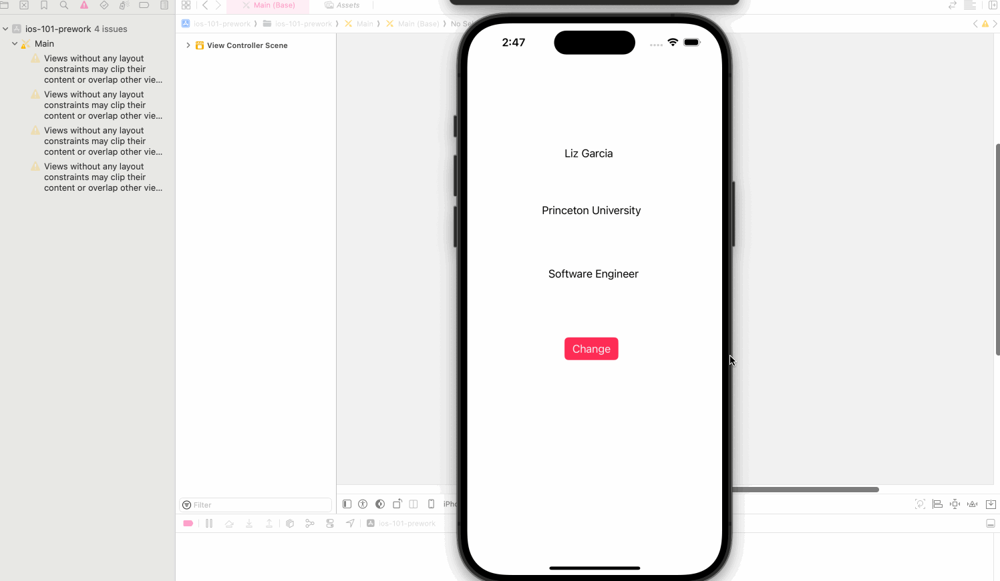

# Prework - *ios-101-prework*

Submitted by: **Liz Garcia**

**ColorChanging* is an app that changes the background color.

Time spent: **1** hour spent in total

## Required Features

The following **required** functionality is completed:

- [x] Users see a screen with three labels and a button
- [x] Tapping the button changes the screen color to a random color
 
## Video Walkthrough

 
Gif created with LICEcap

## App Brainstorming (Step 4)

## Notes

Describe any challenges encountered while building the app. -> None

## License

    Copyright [2024] [Liz Garcia]

    Licensed under the Apache License, Version 2.0 (the "License");
    you may not use this file except in compliance with the License.
    You may obtain a copy of the License at

        http://www.apache.org/licenses/LICENSE-2.0

    Unless required by applicable law or agreed to in writing, software
    distributed under the License is distributed on an "AS IS" BASIS,
    WITHOUT WARRANTIES OR CONDITIONS OF ANY KIND, either express or implied.
    See the License for the specific language governing permissions and
    limitations under the License.

#### Favorite 3 apps
1. Instagram: 1) aesthetic design to display photos and create personal brand via profile, 2) easy to use, 3) can message friends.
2. TikTok: 1) short and entertaining videos, 2) shop page to purchase a lot of items at great prices; video promotions allow users to see products being tested.
3. Snapchat: 1) great filters for photos and videos, 2) can message friends and send them quick, short videos via private message.

#### Idea for personal project
I would like to take the best features of the above 3 popular social media platforms, and create a new social media platform. This new app would contain an aesthetic design, similar to Instagram, in terms of how the photos are displayed and the profiles of each user are shown. You would also be able to message friends and create groups like on all three social media platforms above. From Tiktok, I would include a section where users can share short videos. However, in my app, I would include better video editing tools, because I find Tiktok's editing tools to not be user-friendly. Finally, this app would allow users to create and use filters for their photos and videos similar to Instagram and Snapchat. I will modify the scope of this project as needed, given the duration of the course. I hope to continue working on this project after the course. 
